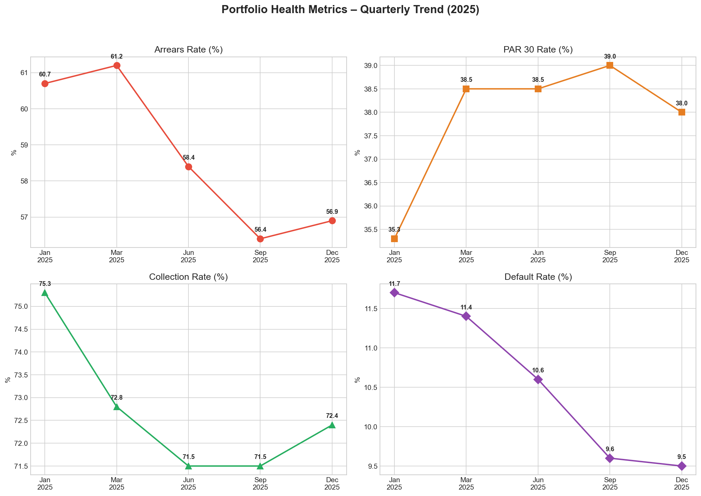
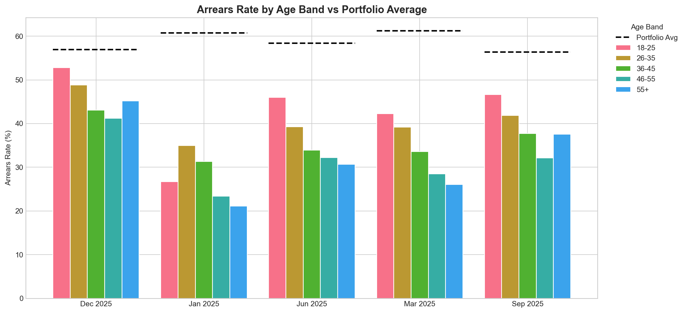
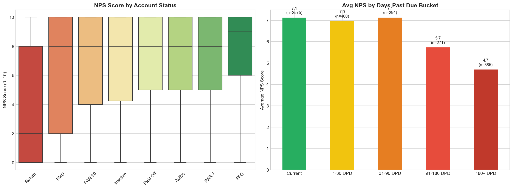
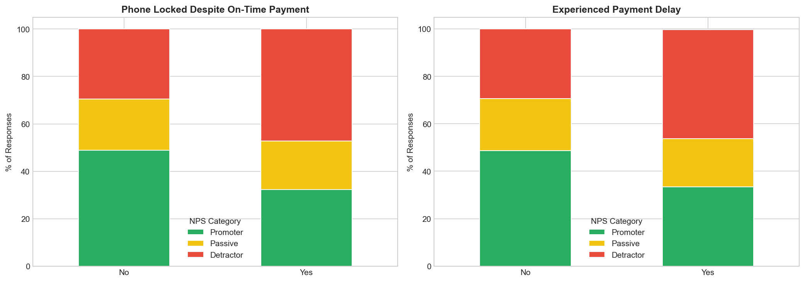

# 📱 MoPhones Case Study — Portfolio Health, CX & Data Quality

> **Data Analyst (Product) Case Study**  
> An end-to-end analysis of MoPhones' credit portfolio, customer experience (NPS), and data quality — covering 20,000+ loans across five quarterly snapshots in 2025.

---

## 📂 Repository Structure

```
MoPhones/
├── Credit Data/
│   ├── Credit Data - 01-01-2025.csv
│   ├── Credit Data - 30-03-2025.csv
│   ├── Credit Data - 30-06-2025.csv
│   ├── Credit Data - 30-09-2025.csv
│   └── Credit Data - 30-12-2025.csv
├── Sales and Customer Data.xlsx        # 4 sheets: Gender, DOB, Income Level, Sales Details
├── NPS Data.xlsx                       # 4,129 Net Promoter Score survey responses
├── MoPhones_Case_Study_Analysis.ipynb  # ⭐ Main analysis notebook
├── q1_portfolio_trends.png             # Chart — quarterly trend of 5 portfolio metrics
├── q1_age_segment.png                  # Chart — arrears rate by age band
├── q2_nps_credit.png                   # Chart — NPS by account status & DPD bucket
├── q2_cx_tension.png                   # Chart — phone locking & payment delay impact
└── README.md                           # You are here
```

---

## 🧰 Tech Stack

| Tool | Version | Purpose |
|------|---------|---------|
| Python | 3.14 | Core language |
| pandas | latest | Data wrangling & aggregation |
| numpy | latest | Numeric operations |
| matplotlib | latest | Charting (Agg backend) |
| seaborn | latest | Statistical visualizations |
| openpyxl | latest | Reading `.xlsx` files |

---

## ⚙️ Setup & Run

```bash
# 1. Create virtual environment
python -m venv .venv
.venv\Scripts\activate        # Windows
# source .venv/bin/activate   # macOS / Linux

# 2. Install dependencies
pip install pandas numpy matplotlib seaborn openpyxl

# 3. Open the notebook
jupyter notebook MoPhones_Case_Study_Analysis.ipynb
```

---

## 📋 Key Assumptions

These are documented at the top of the notebook and drive many analytical decisions:

1. **Age band "18–225"** in the brief is a typo → interpreted as **18–25**
2. **Average monthly income** = `Received / Duration` (the sub-columns are breakdowns, not additive)
3. **`CUSTOMER_AGE`** in the credit CSVs is **days since `SALE_DATE`**, not biological age (values reach 883)
4. **DOB sheet** has a trailing space in `"Loan Id "` — stripped during loading
5. Credit CSVs from Jun/Sep/Dec have **34 columns** (extra blank column); Jan/Mar have 33 — blanks are dropped
6. All Excel sheets hit the **1,048,575 row limit** — rows with null `Loan Id` are dropped as padding
7. NPS responses are joined to the **Dec 2025** credit snapshot (the latest available)

---

## 🔍 Analysis Walkthrough

### 1 — Data Loading & Preparation

**Credit portfolio** — Five quarterly CSVs are loaded, cleaned, and stacked:

```python
credit_files = [
    ("Credit Data - 01-01-2025.csv", "2025-01-01"),
    ("Credit Data - 30-03-2025.csv", "2025-03-31"),
    ("Credit Data - 30-06-2025.csv", "2025-06-30"),
    ("Credit Data - 30-09-2025.csv", "2025-09-30"),
    ("Credit Data - 30-12-2025.csv", "2025-12-30"),
]

dfs = []
for fname, snap_date in credit_files:
    df = pd.read_csv(os.path.join(CREDIT_DIR, fname), encoding="utf-8-sig")
    df = df.loc[:, df.columns.str.strip() != ""]   # drop blank columns
    df["SNAPSHOT_DATE"] = pd.to_datetime(snap_date)
    dfs.append(df)

credit = pd.concat(dfs, ignore_index=True)
# → 20,742 rows × 34 columns across 5 snapshots
```

**Customer demographics** — Gender, DOB, and Income are loaded from separate Excel sheets and merged onto the credit data via `Loan Id`:

```python
credit_enriched = credit.merge(
    dob[["Loan Id", "date_of_birth"]],
    left_on="LOAN_ID", right_on="Loan Id", how="left",
)
credit_enriched["AGE_YEARS"] = (
    (credit_enriched["SNAPSHOT_DATE"] - credit_enriched["date_of_birth"]).dt.days / 365.25
)
```

**Derived features:**
- **Age bands**: 18–25, 26–35, 36–45, 46–55, 55+
- **Income bands**: 8 tiers from *Below 5,000* to *150,000+* (KES)

---

### 2 — Question 1: Portfolio Health (40%)

Five metrics are tracked across all quarterly snapshots:

| # | Metric | Why it matters |
|---|--------|----------------|
| 1 | **Arrears Rate** | % of accounts in arrears — headline credit quality |
| 2 | **PAR 30 Rate** | % with DPD > 30 — standard risk threshold |
| 3 | **Default Rate** | % in FPD/FMD statuses — early-warning for write-offs |
| 4 | **Collection Rate** | Total Paid ÷ Total Due — cash-generation efficiency |
| 5 | **Avg Arrears (KES)** | Mean arrears among delinquent accounts — exposure sizing |

```python
for snap in snapshots:
    s = credit_enriched[credit_enriched["SNAPSHOT_DATE"] == snap]
    arrears_rate = (s["BALANCE_DUE_STATUS"].str.lower() == "arrears").sum() / len(s) * 100
    par30_rate   = (s["DAYS_PAST_DUE"] > 30).sum() / len(s) * 100
    default_rate = s["ACCOUNT_STATUS_L2"].isin(["FPD", "FMD"]).sum() / len(s) * 100
    collection_rate = s["TOTAL_PAID"].sum() / s["TOTAL_DUE_TODAY"].sum() * 100
```

#### Quarterly Trends



#### Segment Analysis — Age Band

The **18–25 age band** consistently shows a higher arrears rate than the portfolio average, making it the highest-risk demographic segment.



**Key Findings:**
- Portfolio is **growing fast** (~9k → 21k accounts) — raw arrears counts will rise even if rates stay flat
- **18–25 year-olds** are the standout risk segment; targeted actions (shorter loan terms, more frequent reminders) could reduce exposure
- Collection Rate trend reveals whether cash recovery keeps pace with growth

---

### 3 — Question 2: Credit Outcomes × Customer Experience (35%)

NPS survey responses are joined to the Dec 2025 credit snapshot:

```python
nps_credit = nps.merge(
    latest_snap[["LOAN_ID", "ACCOUNT_STATUS_L2", "DAYS_PAST_DUE", "ARREARS", ...]],
    left_on="Loan Id", right_on="LOAN_ID", how="inner",
)
# → 100% match rate (4,129 / 4,129 responses)
```

NPS scores are classified as:
```python
def nps_category(score):
    if score >= 9:  return "Promoter"
    if score >= 7:  return "Passive"
    return "Detractor"
```

#### NPS by Account Status & Days Past Due



Average NPS **drops sharply** as delinquency increases — customers in arrears give notably lower scores.

#### The CX Tension: Phone Locking



Customers who had their **phone locked despite paying on time** show a significantly higher detractor rate. Payment-reflection delays compound the problem — customers pay, the system doesn't reflect it fast enough, and the phone gets locked.

**Recommendation:**
> Implement a **24–48 hour grace window** before phone-locking, paired with an automated SMS/push warning. This preserves the collections lever while protecting CX for customers whose payments are delayed by system latency rather than intent. Track both collection rate and NPS for the affected cohort over one quarter to validate.

---

### 4 — Question 3: Data Quality Assessment (25%)

Six issues were identified during the analysis:

| # | Issue | Severity |
|---|-------|----------|
| 1 | **Excel row-limit truncation** — all 4 demographic sheets contain exactly 1,048,575 rows | 🔴 Critical |
| 2 | **Inconsistent join keys** — `"Loan Id "` (trailing space) in DOB sheet vs `"Loan Id"` elsewhere | 🟡 Medium |
| 3 | **Column inconsistency** — Jun/Sep/Dec credit CSVs have 34 cols vs 33 in Jan/Mar | 🟡 Medium |
| 4 | **Ambiguous field names** — `CUSTOMER_AGE` is actually days since sale, not biological age | 🟠 High |
| 5 | **Undocumented status hierarchy** — mapping between `ACCOUNT_STATUS_L1` and `L2` is unclear | 🟡 Medium |
| 6 | **NPS temporal ambiguity** — no instruction on which credit snapshot to pair survey responses with | 🟡 Medium |

**Proposed Improvements:**

| # | Improvement | Impact |
|---|------------|--------|
| 1 | **Migrate to a relational database** (PostgreSQL, BigQuery) | Eliminates 1M row-limit risk; enables type constraints and foreign keys |
| 2 | **Create a unified `dim_customer` table** with `loan_id` as PK | Removes fragmentation across 4 separate sheets |
| 3 | **Standardise credit snapshot schemas** with a fixed column order | Prevents pipeline breakage from shifting columns |

---

### 5 — Bonus: Entity-Relationship Diagram

```
┌──────────────────────────┐
│      dim_customer        │
├──────────────────────────┤
│ PK  loan_id              │
│     date_of_birth        │
│     gender               │
│     citizenship          │
│     avg_monthly_income   │
│     income_band          │
│     age_band             │
└───────────┬──────────────┘
            │  1 : N
            ▼
┌──────────────────────────────────┐
│    fct_credit_snapshot           │
├──────────────────────────────────┤
│ PK  loan_id + snapshot_date     │
│ FK  loan_id → dim_customer      │
│     total_paid                   │
│     total_due_today              │
│     balance                      │
│     days_past_due                │
│     arrears                      │
│     balance_due_status           │
│     account_status_l1            │
│     account_status_l2            │
│     collection_rate              │
└───────────┬──────────────────────┘
            │
  ┌─────────┴─────────┐
  ▼                    ▼
┌────────────────────┐  ┌────────────────────┐
│    dim_sale        │  │   fct_nps_survey   │
├────────────────────┤  ├────────────────────┤
│ PK  sale_id        │  │ PK  submission_id  │
│ FK  loan_id        │  │ FK  loan_id        │
│     sale_date      │  │     submitted_at   │
│     sale_type      │  │     nps_score      │
│     seller         │  │     nps_category   │
│     cash_price     │  │     happy_device   │
│     loan_price     │  │     happy_service  │
│     product_name   │  │     phone_locked   │
│     model          │  │     payment_delay  │
│     loan_term      │  └────────────────────┘
└────────────────────┘
```

All tables join on **`loan_id`**. The snapshot fact table uses a composite PK (`loan_id` + `snapshot_date`) to track each loan through time.

---

## 📊 Output Summary

| Output | Description |
|--------|-------------|
| `MoPhones_Case_Study_Analysis.ipynb` | Full analysis notebook — run top-to-bottom |
| `q1_portfolio_trends.png` | 4-panel quarterly trend of Arrears Rate, PAR 30, Collection Rate, Default Rate |
| `q1_age_segment.png` | Grouped bar chart — arrears rate by age band vs portfolio average |
| `q2_nps_credit.png` | Boxplot + bar chart — NPS by account status and DPD bucket |
| `q2_cx_tension.png` | Stacked bar — NPS category split for phone locking & payment delay |

---

## 📝 License

This repository contains a case study submission and is not intended for redistribution.
